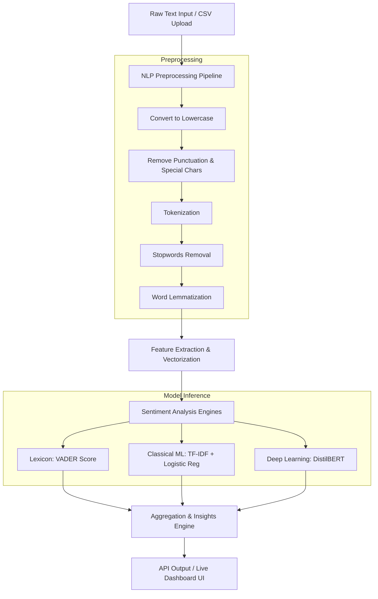

# Product Requirements Document (PRD)
## Project Name: AI-Based Sentiment Analysis Dashboard (Mini Project) — 2026
**Author:** Antigravity AI
**Date:** June 2026
**Status:** Draft / Ready for Implementation

---

## 1. Executive Summary
Customer feedback is a goldmine of insights, but manually reading thousands of reviews is impossible. The **AI-Based Sentiment Analysis Dashboard** is a lightweight, high-performance web application designed to classify, aggregate, and visualize textual customer feedback. It leverages a hybrid Natural Language Processing (NLP) pipeline combining lexicon-based, classical machine learning, and deep learning models to extract sentiment polarities (Positive, Neutral, Negative) and identify recurring user patterns or concerns. 

This project is tailored for developer portfolios, showcasing clean NLP preprocessing, robust model evaluation, and an interactive, premium frontend analytics dashboard.

---

## 2. Product Goals & Core Value Proposition
* **Automate Sentiment Classification:** Instantly classify single and bulk textual feedback into Positive, Neutral, or Negative sentiment categories.
* **Demystify NLP Preprocessing:** Provide visual step-by-step trace of how raw text is cleaned (lowercase conversion, punctuation removal, stopword filtering, and lemmatization).
* **Identify Actionable User Concerns:** Extract key terms and phrases driving negative sentiment to help businesses prioritize feature fixes or support issues.
* **Bulk Processing & Reporting:** Allow users to upload CSV feedback datasets and export structured sentiment reports.

---

## 3. Tech Stack (2026 Standard)

To ensure high performance, ease of deployment, and modern standards, the project uses a **Python-based Backend** and a **Vanilla HTML/CSS/JS Frontend** served as a unified web app. This removes the overhead of complex Node modules/build steps, making the mini-project portable and easy to run locally.

### Backend (Python 3.10+)
* **Framework:** `FastAPI` — Modern, ultra-fast web framework with auto-generated OpenAPI documentation.
* **NLP & Processing:**
  * `NLTK` or `SpaCy` — For tokenization, stopword removal, and lemmatization.
  * `VADER (nltk.sentiment.vader)` — For lexicon-based, rule-based sentiment scoring (excellent for social media, emojis, and negations).
  * `Scikit-Learn` — For classical ML: `TfidfVectorizer` + `LogisticRegression` (trained on a sample customer feedback corpus to show classical ML comparison).
  * `Transformers (Hugging Face)` *(Optional / Advanced Toggle)* — Pre-trained `distilbert-base-uncased-finetuned-sst-2-english` for deep-learning-based classification.
* **Server:** `Uvicorn` — ASGI web server implementation.
* **File Processing:** `Pandas` — For fast CSV/Excel parsing and analytics.

### Frontend (Modern Vanilla Web Stack)
* **Structure:** `HTML5` semantic elements.
* **Styling:** `CSS3` Custom Variables (CSS variables for theming, premium **glassmorphism** design, responsive layout, dark mode by default).
* **Visualizations:** `Chart.js` (via CDN) — Responsive charts for sentiment breakdown, trends, and token counts.
* **Interactions:** `Vanilla JavaScript (ES6)` — Clean asynchronous `fetch` calls, dynamic DOM manipulation, and debounced typing events.

---

## 4. System Architecture & NLP Pipeline

The application processes text data through the following sequence:

---

## 5. Functional Requirements & Feature Specifications

### Feature 1: Real-time Text Analyzer Sandbox
* **Description:** A sandbox text area where users can type or paste feedback and see live sentiment analysis.
* **Details:**
  * **Debounced input** (waits 400ms after user stops typing to trigger API call).
  * Returns sentiment label (Positive, Neutral, Negative) and confidence/intensity scores.
  * **NLP Pipeline Visualizer:** Shows the exact transformation of their input:
    * *Original:* "I really don't like the new interface, it's very confusing!"
    * *Cleaned:* "like interface confusing" (stopwords removed, verbs lemmatized).
  * Highlights positive words in green and negative words in red.

### Feature 2: Bulk CSV Upload & Processing
* **Description:** Users upload feedback spreadsheets to analyze datasets in bulk.
* **Details:**
  * Drag-and-drop zone supporting `.csv` files.
  * Simple dropdown to select which column contains the feedback text.
  * Displays a paginated preview table of the processed dataset showing: *Raw Text, Cleaned Text, VADER Score, Predicted Sentiment*.
  * Progress bar showing processing status for larger datasets.
  * Download button to export the resulting CSV with sentiment classification columns appended.

### Feature 3: Interactive Analytics Dashboard
* **Description:** Displays rich visualizations and summaries of the uploaded/entered text.
* **Details:**
  * **Summary Metrics:** Total reviews analyzed, Average sentiment score, Sentiment distribution percentages (Positive vs. Negative vs. Neutral).
  * **Sentiment Breakdown Chart:** Doughnut chart showing percentage split.
  * **Common Concerns / Topics:** Top 10 most frequent words in Negative feedback (helping identify user concerns like "bug", "crash", "slow", "expensive") vs. Positive feedback ("fast", "love", "easy", "great").
  * **Sentiment Score Gauge:** Dynamic needle gauge showing current overall customer satisfaction score (ranging from -1.0 to +1.0).

### Feature 4: PDF Report Generator
* **Description:** Generates a professional summary report of the feedback metrics.
* **Details:**
  * Printable-friendly dashboard view or explicit PDF download.
  * Includes the distribution charts, summary metrics, and top keywords driving user reviews.

---

## 6. Design & Aesthetic Requirements

The interface must look premium, modern, and highly interactive (wow factor).

* **Color Palette (Modern Dark Theme):**
  * Background: `#0B0F19` (Deep slate blue-black)
  * Cards / Containers: `#161D30` with `backdrop-filter: blur(10px)` (Glassmorphism effect)
  * Positive Sentiment Accent: `#10B981` (Vibrant emerald green)
  * Negative Sentiment Accent: `#EF4444` (Vibrant rose red)
  * Neutral Sentiment Accent: `#F59E0B` (Amber yellow)
  * Accent Borders: Linear gradients (e.g., indigo-to-purple) with low opacity.
* **Typography:** `Inter` or `Outfit` loaded from Google Fonts.
* **Micro-interactions:**
  * Smooth scale transitions (`scale(1.02)`) on hovering cards.
  * Interactive tooltips on Chart.js charts.
  * Glow effects (`box-shadow: 0 0 15px rgba(x,y,z, 0.4)`) on sentiment labels depending on the classification.

---

## 7. API Endpoints (FastAPI)

| Method | Endpoint | Request Body | Description |
|---|---|---|---|
| `GET` | `/` | None (Serves HTML) | Serves the main UI index.html |
| `POST` | `/api/analyze/single` | `{"text": "string", "model": "vader|ml|transformer"}` | Analyzes single text, returns NLP steps and polarity |
| `POST` | `/api/analyze/bulk` | `Multipart/Form-Data` (CSV file) | Uploads CSV, parses, performs sentiment classification, returns aggregates and a temp file link |
| `GET` | `/api/export/{job_id}` | Path parameter | Downloads the labeled CSV for the bulk analysis |
| `POST` | `/api/train` | Optional dataset payload | Re-trains/updates the classical ML model with custom feedback |

---

## 8. Verification & Validation Plan
* **API Testing:** Fast execution of requests via FastAPI's built-in Swagger docs (`/docs`).
* **NLP Pipeline Unit Tests:** Test preprocessing functions to confirm stopwords removal and lemmatization match expectations (e.g. "running" -> "run", "better" -> "good").
* **Model Accuracy Check:** Run evaluation metrics (Accuracy, Precision, Recall, F1-Score) on the Classical ML model using a split dataset and display it in a "Model Info" panel on the UI.
